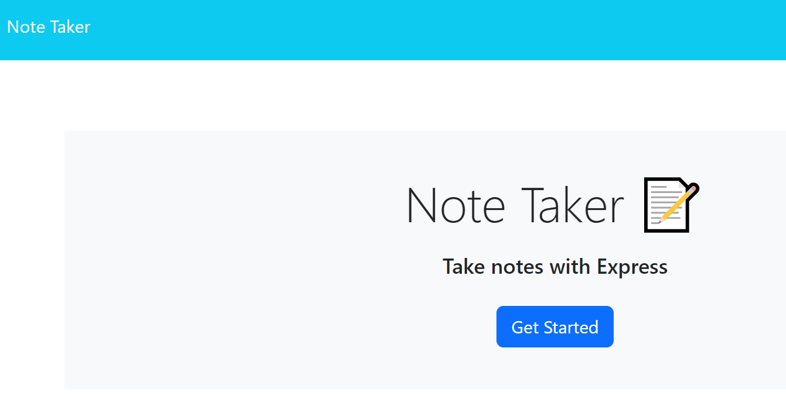

# Note-Taker

## Description

An application for small business owners that can be used to write and save notes to keep track of tasks.

## Installation

N/A

## Usage

To use this website, open ([Note Taker](https://fast-brushlands-14794-3f4df896ce54.herokuapp.com/notes)) in a browser. Click the "get started" button to enter the application. Click into the "note title" field and type a title for your note. Then click into the "note text" field and enter the body of your note. Once your note is completed, click the save button in the top right-hand corner of the page. The note will populate in the lefthand side of the page. Notes can also be deleted by clicking the trashcan icon next to the desired note.

## Credits

N/A

## License

Please refer to the LICENSE in the repo.
